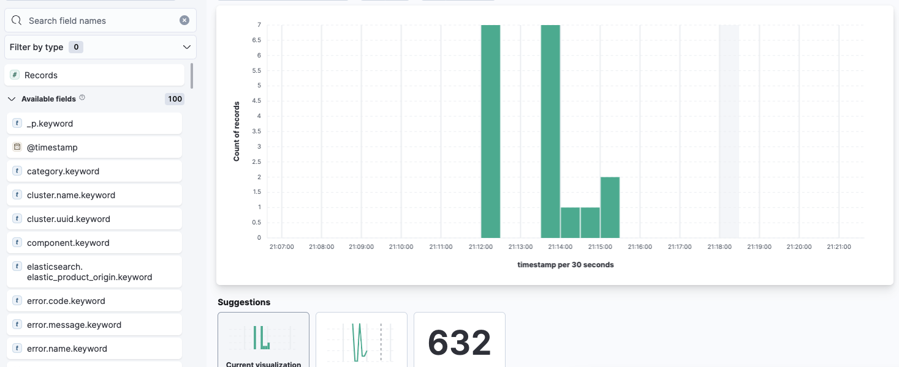

# EFK-digitalocean-k8s
[](https://github.com/tterb/atomic-design-ui/blob/master/LICENSEs)

A basic deployment of a log monitoring system (Elasticsearch/FluentBit/Kibana) to a Digital Ocean Kubernetes cluster using Elastic Cloud on Kubernetes (ECK). [This Quickstart](https://www.elastic.co/guide/en/cloud-on-k8s/current/k8s-quickstart.html) implementation was followed for this deployment.

## Create k8s cluster on Digital Ocean

Sign up for a Digital Ocean account and create a Kubernetes cluster. 

Select a Kubernetes version, a (closest) datacenter region, and a cluster capacity. In my case, I chose the default 3 nodes, each with 2.5GB RAM usable & 2 vCPUs. *Note that if your cluster does not have any nodes with at least 2GiB of free memory, some pods can become stuck in `Pending` state.* 


Using this configuration generates an estimated $60/month. In my case, I had to request a Droplet limit increase from 1 to 5 in order to get my project working.

The cluster creation will take about 5 minutes to complete-- in the meantime, you can authorize doctl with your personal access token, and configure your connection to the k8s cluster.

## Deploy ECK

Elastic Cloud on Kubernetes (ECK) is the official operator by Elastic and extends basic k8s orchestration capabilities to easily deploy your Elasticsearch cluster.

First, install CRDs and the operator:

```
kubectl create -f https://download.elastic.co/downloads/eck/1.9.1/crds.yaml
kubectl apply -f https://download.elastic.co/downloads/eck/1.9.1/operator.yaml
```

You can monitor the operator logs as such:


## Deploy an Elasticsearch cluster

You can apply a simple Elasticsearch cluster specification:

```
kubectl create -f elasticsearch.yaml
```
The operator automatically creates and manages the k8s resources. After checking the cluster health and creation progress, you can request Elasticsearch access after getting the credentials as outline [here](https://www.elastic.co/guide/en/cloud-on-k8s/current/k8s-deploy-elasticsearch.html). You can verify with port-forward:


## Deploy Kibana

You can apply a Kibana instance in a similar fashion:

```
kubectl create -f kibana.yaml
```
In order to access Kibana, port-forward


and open up `https://localhost:5601` in your browser. You can login with `elastic` user and enter the password obtained with this command as outlined [here](https://www.elastic.co/guide/en/cloud-on-k8s/current/k8s-deploy-kibana.html):

```
kubectl get secret quickstart-es-elastic-user -o=jsonpath='{.data.elastic}' | base64 --decode; echo
```

## Deploy Fluent Bit

Lastly you can deploy Fluent Bit [using a helm chart](https://fluentbit.io/blog/2020/12/29/deploying-fluent-bit-k8s-5-minutes/). 

By editing this output section of the `values.yaml`, you can specify to forward the logs to Elasticsearch:

```
outputs:
    [OUTPUT]
        Name es
        Match kube.*
        Host 127.0.0.1
        Port 9200
        Logstash_Format On
        tls On
        tls.verify Off
```

And then you can deploy:

```
helm install fluent-bit fluent/fluent-bit -f values.yaml
```

After verifying with the following:
```
NAME: fluent-bit
LAST DEPLOYED: Fri Dec 31 21:12:09 2021
NAMESPACE: default
STATUS: deployed
REVISION: 1
NOTES:
Get Fluent Bit build information by running these commands:

export POD_NAME=$(kubectl get pods --namespace default -l "app.kubernetes.io/name=fluent-bit,app.kubernetes.io/instance=fluent-bit" -o jsonpath="{.items[0].metadata.name}")
kubectl --namespace default port-forward $POD_NAME 2020:2020
curl http://127.0.0.1:2020
```

we can go back to the Kibana dashboard and create `logstash*` index pattern:



We have successfully deployed EFK stack to the Digital Ocean k8s cluster!